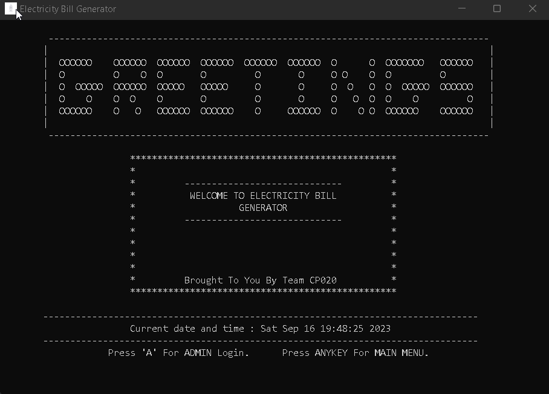
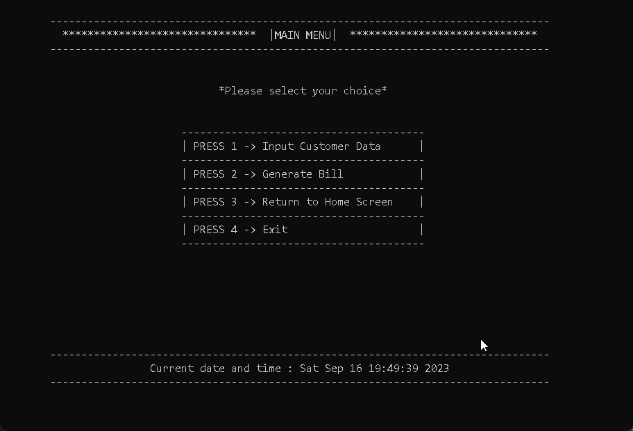
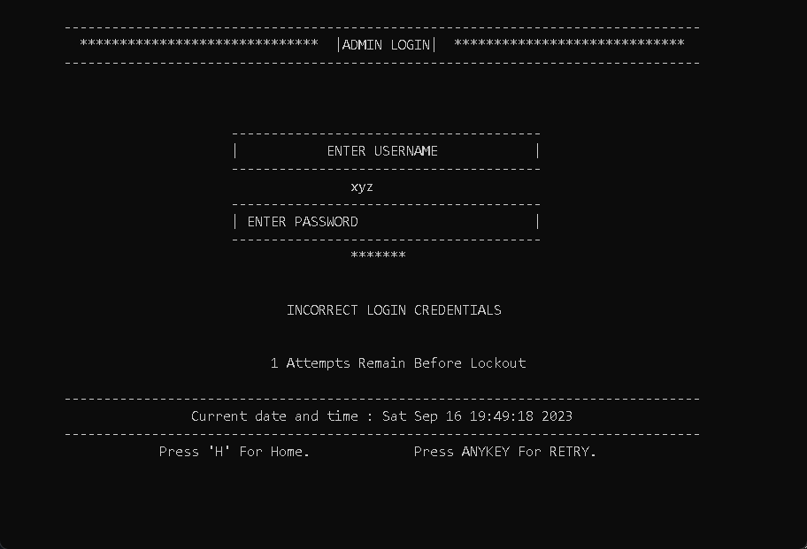
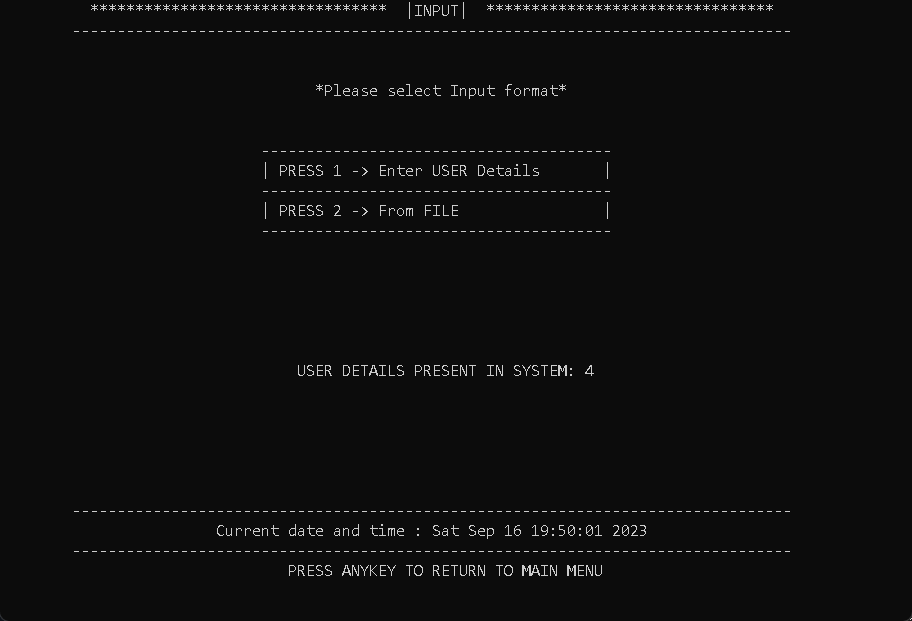
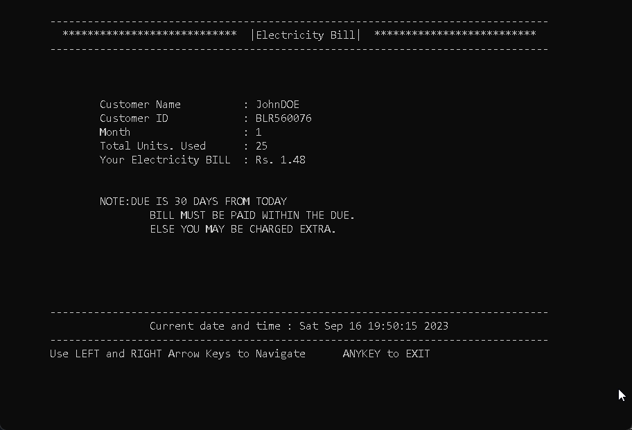
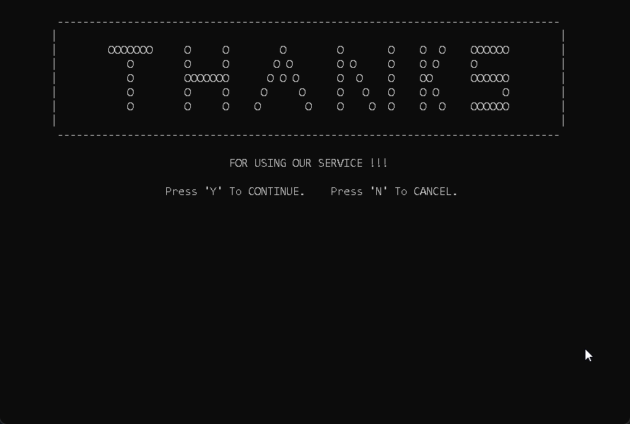

# Electricity Bill Generator

The Electricity Bill Generator project is designed to streamline and automate the billing process. Its primary purpose is to enhance operational efficiency by accurately calculating and generating electricity bills. The project encompasses user information input, billing calculations, and reporting, ensuring a comprehensive solution.

It is an application which will take input manually or either in the form of a .csv file which has to be of the format

name,ID,month,units

there is also an option to access admin menu where tariff rate and due date can be changed allowing one to customise this software according to the need and allowing adaptability.
The admin menu can be accessed by these login details which are currently hardcoded.

username : ADMIN

Password : CP020

## Authors

- [@Kshitish Shetty](https://www.github.com/kshitish-shetty)
- [@Bharath P](https://www.github.com/bharathpofficial)
- [@Avish Kumar](https://www.github.com/AK0728)
- [@Dhanush S U](https://www.github.com/dhanush182003)
- [@Shriman Jain](https://www.github.com/Shriman-Jain)

## License

[GNU GPL ](https://www.gnu.org/licenses/)

## Support

For support, email kshitishshetty@gmail.com

## Screenshots

Home Page

Main Menu

Admin Login Page

Input Menu

Console Output

Exit Confirmation Page

